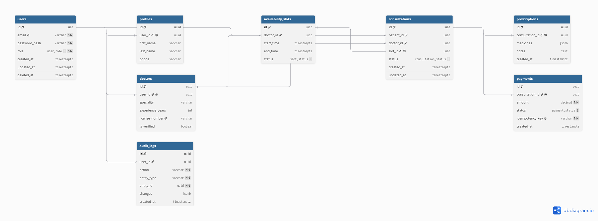

# Architecture Document: HealthCare Booking & Consultation API

## 1. System Overview & Tech Stack
This document outlines the architecture for the HealthCare Booking & Consultation API, designed to handle 100k daily consultations with high availability (99.95%) and strict latency requirements (p95 < 200ms for reads, < 500ms for writes).

*   **Language & Framework:** Node.js with TypeScript and Express.js. Chosen for its asynchronous, non-blocking I/O, which is ideal for handling high concurrent connections at scale.
*   **Database:** PostgreSQL. Chosen for robust relational integrity, complex queries, and ACID compliance required for healthcare and payment data.
*   **Caching & Background Jobs:** Redis. Used for fast read operations and as a message broker for asynchronous tasks.
*   **Architecture Pattern:** Modular Services with Dependency Injection (DI) to ensure clean separation of concerns and testability.
*   **Deployment:** Containerized deployment using Docker and CI/CD pipelines.

## 2. High-Level Architecture & Data Flow

The system follows a layered modular architecture:

1.  **Client Request:** Hits the API Gateway / Nginx Load Balancer.
2.  **API Gateway:** Handles Rate Limiting, initial input validation, and SSL termination.
3.  **Application Layer:** Node.js backend utilizing modular services (e.g., `AuthService`, `BookingService`, `ConsultationService`).
4.  **Data Layer:** 
    *   **Writes:** Directed to the PostgreSQL primary database. Middleware strictly enforces idempotency for critical writes (e.g., bookings, payments).
    *   **Reads:** Doctor availability and search queries are served from Redis Cache to maintain < 200ms latency.

## 3. Caching, Data Partitioning, and Concurrency Handling
To scale up to 100k daily consultations:
*   **Caching Strategy:** Doctor profiles and availability slots are cached in Redis. Cache invalidation occurs automatically when a slot is booked or a doctor updates their schedule.
*   **Concurrency Handling (Double Booking Prevention):** We utilize PostgreSQL composite unique constraints `(doctor_id, start_time)` and Pessimistic Locking (`SELECT ... FOR UPDATE`) during the booking transaction to prevent race conditions.
*   **Data Partitioning:** Heavy tables like `audit_logs` and `consultations` are partitioned by `created_at` (monthly) to ensure database queries remain performant over time.

## 4. Transaction Management & Sagas
*   **Booking Flow & Sagas:** The booking lifecycle involves multiple steps (Reserve Slot -> Process Payment -> Notify). We implement the Saga pattern. If the payment step fails, a compensating transaction automatically reverts the slot status to 'Available'.
*   **Idempotency:** Critical write operations (Booking, Payments) require an `Idempotency-Key` in the request header. The system stores these keys in a Redis/Postgres table for 24 hours to silently ignore duplicate network requests, ensuring no user is charged twice.

## 5. Retry & Backoff Strategies
*   **External API Failures:** Communications with external services (SMS, Email, Payment Gateways) use an Exponential Backoff strategy to prevent system overload during third-party downtimes.
*   **Asynchronous Processing:** Heavy tasks such as generating prescription PDFs or sending emails are offloaded to Redis-backed queues (e.g., BullMQ) with built-in retry mechanisms and dead-letter queues (DLQ).

## 6. Security & Threat Modeling
Security is implemented based on OWASP top 10 mitigation guidelines:
*   **Authentication & Authorization:** JWT-based stateless authentication with Multi-Factor Authentication (MFA) support. Strict Role-Based Access Control (RBAC) separates Patient, Doctor, and Admin flows.
*   **Data Protection:** Data in transit is secured via TLS. Personally Identifiable Information (PII) and medical records in PostgreSQL are protected using data classification and at-rest encryption.
*   **Secret Management:** All keys and secrets are managed via environment variables with a defined key rotation policy.
*   **Attack Surface Mitigation:** API endpoints are protected against brute-force attacks via rate limiters. Input validation is strictly enforced using Zod/Class-validator.
*   **Dependency Scanning:** The CI pipeline includes automated dependency scanning (e.g., `npm audit` or Snyk) to catch vulnerable packages before deployment.

## 7. Observability & Audit Trails
*   **Metrics & Traces:** We utilize Prometheus and Grafana (or similar APM tools) to track system metrics, specifically monitoring p95 latency targets and memory usage.
*   **Logging:** Centralized structured logging (JSON format) is implemented for all application errors and critical state changes.
*   **Compliance (Audit Trails):** Every sensitive action (e.g., updating a prescription, modifying user roles) asynchronously writes a detailed record to the `audit_logs` table, storing the `user_id`, `action`, and `changes` (old vs. new state) for healthcare compliance.